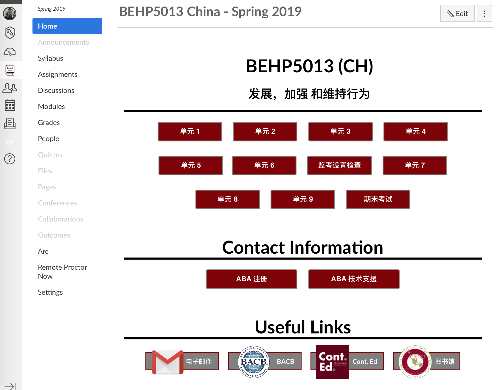
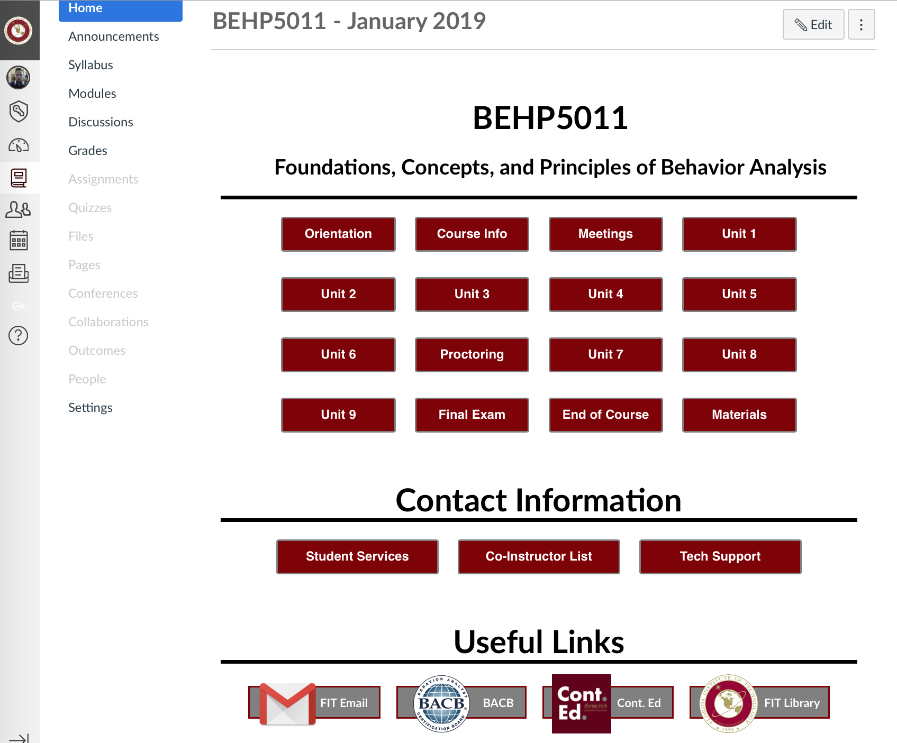

# CanvasLMS
*******JS Code Countdown Timer*******

The countdown timer is a code written in JS that utilizes the Canvas API to obtain info such as when the student logs in and when they begin the first assignment in the course. After submitting first assignment, countdown timer begins. Student has 180 days to complete course, otherwise the certificate is invalid and they are blocked from the course. 

